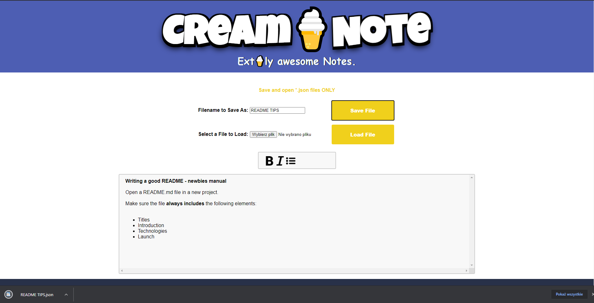
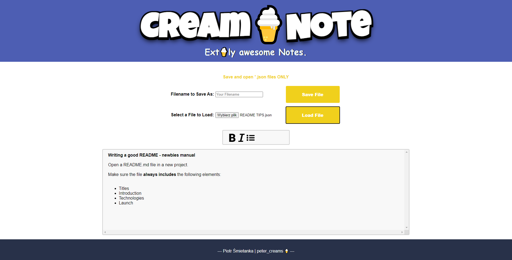

# Cream-Note
Simple note app to make and open them in .json format. Created with JavaScript.

## Table of Contents
* [General info](#general-info)
* [Technologies](#technologies)
* [Launch](#launch)

## General Info
Make notes on your computer, stylize them using simple formatting: bold, italicize text, and use simple list-style formatting.
Download your '.json file' on your 'hard drive' and open it later on.

### Make notes


### Download .json


### Load .json


#### Enjoy!

## Technologies
* JavaScript
* HTML
* CSS 

## Launch
To run this project, just open it in the browser:
```
https://petercreams.github.io/Cream-Note/
```
